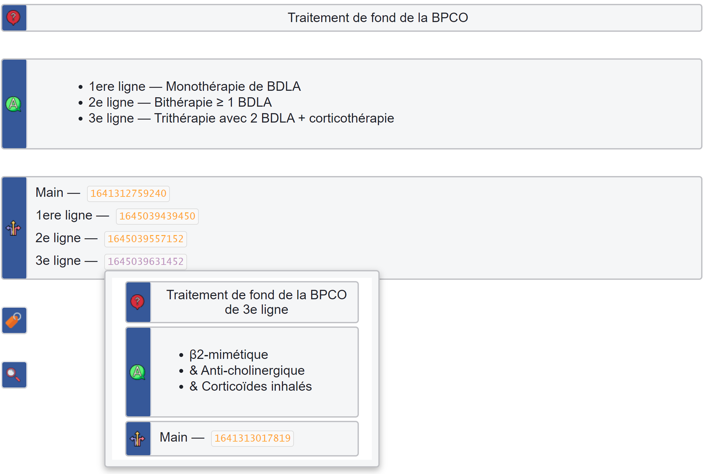
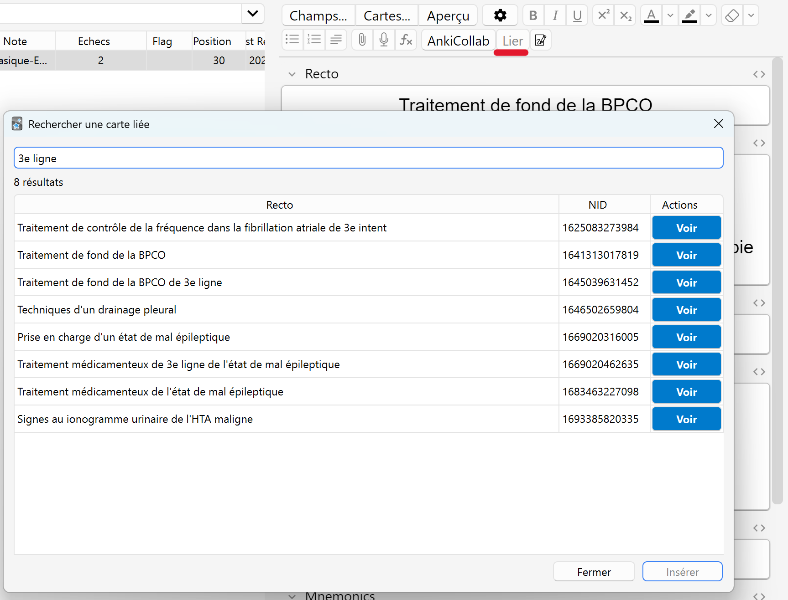

# Anki EDN - Lier les Cartes

**Recherche et liaison rapide de cartes pour Anki**

Cet addon permet de créer des liens entre vos cartes Anki facilement, facilitant la navigation et l'interconnexion de vos connaissances.

## ✨ Fonctionnalités

### 🔗 Liaison de cartes
- **Recherche rapide** : Trouvez et liez des cartes en quelques secondes
- **Aperçu des cartes liées** : Survolez un hyperlien pour afficher instantanément un aperçu interactif de la carte liée.
- **Liens cliquables** : Cliquez sur un hyperlien dans le reviewer pour ouvrir la carte dans le browser
- **Copie de NID** : Copiez facilement l'identifiant d'une carte

### ⌨️ Raccourcis personnalisables
- `Ctrl+Alt+L` : Ouvrir le dialog de recherche (ou lier directement si un NID est sélectionné)
- `Ctrl+Alt+C` : Copier le NID de la carte sélectionnée dans le browser
- `nid:` : Tapez ces 4 caractères dans l'éditeur pour ouvrir automatiquement le dialog de recherche

## 📦 Fonctionnalités intégrées

Cet addon intègre les fonctionnalités suivantes (aucune installation externe requise) :
- [**Link Cards**](https://ankiweb.net/shared/info/1170639320) : Fonctionnalités complètes de liaison
- [**Open Multiple Windows**](https://ankiweb.net/shared/info/354407385) : Support multi-fenêtres pour le browser

## 🚀 Installation

### Via AnkiWeb
1. Allez dans `Tools > Add-ons > Get Add-ons...`
2. Entrez le code : `[445658251]` 
3. Redémarrez Anki

### Depuis le fichier .ankiaddon
1. Téléchargez le fichier `.ankiaddon` depuis [GitHub](https://github.com/[VOTRE_COMPTE]/anki-edn-linked-cards/releases)
2. Dans Anki, allez dans `Tools > Add-ons > Install from file...`
4. Sélectionnez le fichier téléchargé
5. Redémarrez Anki

## 📖 Guide d'utilisation

### Lier une carte

**Méthode 1 : Via le dialog de recherche**
1. Placez votre curseur dans l'éditeur
2. Appuyez sur `Lier`, `Ctrl+Alt+L` ou tapez `nid:`
3. Recherchez la carte que vous voulez lier
4. Cliquez sur "Insérer" ou double-cliquez sur la carte

**Méthode 2 : Liaison rapide**
1. Copiez le NID d'une carte (`Ctrl+Alt+C` dans le browser)
2. Collez-le dans l'éditeur
3. Sélectionnez le NID et appuyez sur `Ctrl+Alt+L`
4. Le lien est créé automatiquement

### Naviguer via les liens

Dans le reviewer, passez la souris pour voir un aperçu, ou cliquez sur l'hyperlien pour ouvrir la carte liée dans le browser.

### Personnaliser les raccourcis

1. Ouvrez le menu `Anki EDN > ⚙️ Paramètres EDN...`
2. Allez dans l'onglet "⌨️ Raccourcis"
3. Modifiez les raccourcis selon vos préférences
4. Cliquez sur "✅ Appliquer" et redémarrez Anki

## 📄 Licence

Creative Commons Attribution-ShareAlike 4.0 International (CC BY-SA 4.0)

Vous êtes libre de :
- **Partager** : copier et redistribuer le matériel sous quelque support que ce soit
- **Adapter** : remixer, transformer et créer à partir du matériel

**Sous les conditions suivantes** :
- **Attribution** : Vous devez créditer l'œuvre
- **Partage dans les mêmes conditions** : Si vous modifiez, transformez ou créez à partir du matériel, vous devez diffuser vos contributions sous la même licence

## 💡 Support

Pour toute question, suggestion ou rapport de bug :
- [**Anki EDN**](https://tools.c2su.org/Anki_EDN/book/)
- [**Discord Anki EDN**](https://discord.gg/2A7zHAEBYt)
- [**GitHub**](https://github.com/C2SU/Anki_EDN_Lier_Les_Cartes)
- [**AnkiWeb**](https://ankiweb.net/shared/info/445658251)